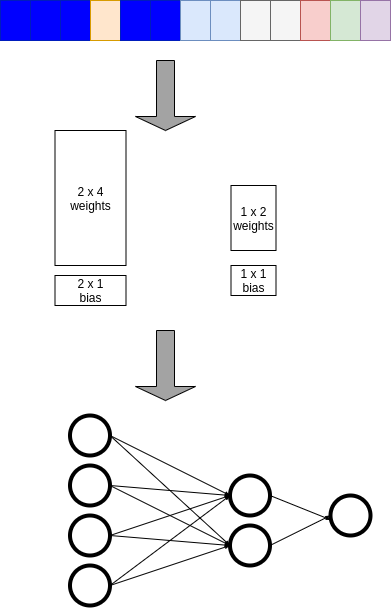

## Usage of genetic algorithms to train a neural network in the multiple OpenAI gym environments. 
***
| Random Carracing | GA Carracing |
| ------------- |:-------------:|
|  |  |

 | Random BipedalWalker-v2 | GA BipedalWalker-v2 | 
| ------------- |:-------------:|
|  |  |

 | Random Cartpole-v0 | GA Cartpole-v0 | 
| ------------- |:-------------:|
|  |  |


### Run and test
Pretrained models are located in `models` folder. Testing scripts are in `scripts/tests`.
E.g. for BipedalWalker-2 there are models with different architecture of NN like simple one layer or two layers perceptron (just load appropriate model).

```shell script
python scripts/tests/bipedalwalker/testing_model_bipedalwalker.py
```

### Explanation

##### Overview
From Cartpole-v0 we get vector of observations and reward for each action (0/1) given to the environment.
The observations is feed into MLP with 4-2-1 architecture and sigmoid function as the output.
Usually to train the neural network we can use backpropagation algorithm, however here I use a genetic algorithm.
The goal of the GA is to find the optimal values of weights and biases for a given network.


|  |  |  |
| -- | -- | --|
| | |

##### Fitness function

Function fitness is the sum of rewards. Here is sample code (`nn` is a single neural network):
```python
env = gym.make('CartPole-v0')

def get_fitness(n_episodes):
    obs = env.reset()
    fitness = 0
    for episode in range(n_episodes):
        action = nn.forward(obs)
        obs, reward, done, _ = env.step(action)
        fitness += reward
        if done:
            break
    return fitness
```

|  |
|:---:| 
| Mean value of fitness function for BipedalWalker-v2 problem |


##### Algorithm

1. Create initial population of neural networks. At first the weights and biases are randomly initialized.
2. Calculate fitness function for each individual.
3. Weights and biases are transformed into a single vector.
4. Selection (elitism selection or roulette wheel selection)
5. Crossover (simple crossover or [BLX-alpha](http://www.tomaszgwiazda.com/blendX.htm))
6. Mutation (change value of one gen in NN from normal distribution)
7. If children fitness is greater than parents fitness score the new population is updated
8. Go to 2.

## [CarRacing-v0](https://gym.openai.com/envs/CarRacing-v0/)

<table>
  <tr>
	  <th><i>Info</i></th>
	  <th><i>Architecture of neural network</i></th>
  </tr>
  <tr>
	  <td><b>Observation space</b>:<br><br>- RGB 96x96 pixels frame (with all the control bar on the bottom of the screen)</td>
    <td rowspan="4"></td>
  </tr>
  <tr>
	  <td><b>Actions</b>(continues):<br><br>- sterring angle (s = [-1, 1])<br>- throttle (t = [0, 1])<br>- brake (b = [0, 1])</td>
  </tr>
  <tr>
	  <td><b>Reward</b><br><br>- -0.1 every frame and +1000/N for every track tile visited, 
		    <br>   where N is the total number of tiles in track<br></td>
  </tr>
  <tr>
	  <td><b>Genetic algorithm parameters</b><br>- population size: 50 <br>- generation: 2000 <br>- mutation rate: 0.4 <br>- crossover rate: 0.8</td>
  </tr>
</table>


## [BipedalWalker-v2](https://github.com/openai/gym/wiki/BipedalWalker-v2)
              
<table>
  <tr>
	  <th><i>Info</i></th>
	  <th><i>Architecture of neural network</i></th>
  </tr>
  <tr>
    <td><b>Environment</b> (continuous) <br><br>- 24 observations (hull_angle, vel_x, vel_y and many more)</td>
    <td rowspan="5"></td>
  </tr>
  <tr>
    <td><b>Actions</b> (continues): <br><br>- Hip_1 and Hip_2 (Torque / Velocity) <br>- Knee_1 and Knee_2 (Torque / Velocity)</td>
  </tr>
  <tr>
	  <td><b>A reward</b> is given for moving forward, total of 300+ points up to the far end. <br>If the robot falls, it gets -100</td>
  </tr>
  <tr>
    <td><b>Episode Termination</b><br> The episode ends when the robot body touches ground or <br> the robot reaches the far right side of the environment</td>
  </tr>
  <tr>
    <td><b>Genetic algorithm parameters</b><br>- population size: 50 <br>- generation: 2000 <br>- mutation rate: 0.3 <br>- crossover rate: 0.9<br></td>
  </tr>
</table>
	      
## [Cartpole-v0](https://github.com/openai/gym/wiki/CartPole-v0)

<table>
  <tr>
	  <th><i>Info</i></th>
	  <th><i>Architecture of neural network</i></th>
  </tr>
  <tr>
	  <td><b>Environment</b> (continuous)<br><br> - 4 observations (Cart Position and Velocity, Pole Angle and Velocity at Tip)</td>
    <td rowspan="5">  </td>
  </tr>
  <tr>
	  <td><b>Actions</b> (discrete):<br><br> - Push a cart to the left or right</td>
  </tr>
  <tr>
	  <td><b>Reward</b> <br><br>- 1 for every step taken, including the termination step<br></td>
  </tr>
  <tr>
	  <td><b>Episode Termination</b><br><br> - Pole Angle is more than ±12°<br> - Cart Position is more than ±2.4 (center of the cart reaches the edge of the display)<br> - Episode length is greater than 200</td>
  </tr>
  <tr>
	  <td><b>Genetic algorithm parameters</b><br> - population size: 100<br> - generation: 20<br> - mutation rate: 0.4<br> - crossover rate: 0.9<br></td>
  </tr>
</table>


***

### Run on [**Spell**](https://web.spell.run/robjan/)
```shell script
spell run "python scripts/bipedalwalker.py" --pip-req requirements.txt
```
For _Carracing_ (need to open virtual display server)
```shell script
spell run --apt python-dev --apt cmake --apt zlib1g-dev --apt libjpeg-dev \
	--apt xvfb --apt ffmpeg --apt xorg-dev --apt python-opengl --apt libboost-all-dev \
	--apt libsdl2-dev --apt swig \ 
	"Xvfb :1 -screen 0 1024x768x24 -ac +extension GLX +render -noreset &> xvfb.log ; export DISPLAY=:1 ; python scripts/spell/carracing_conv_spell.py" \ 
	--pip-req requirements.txt
```
